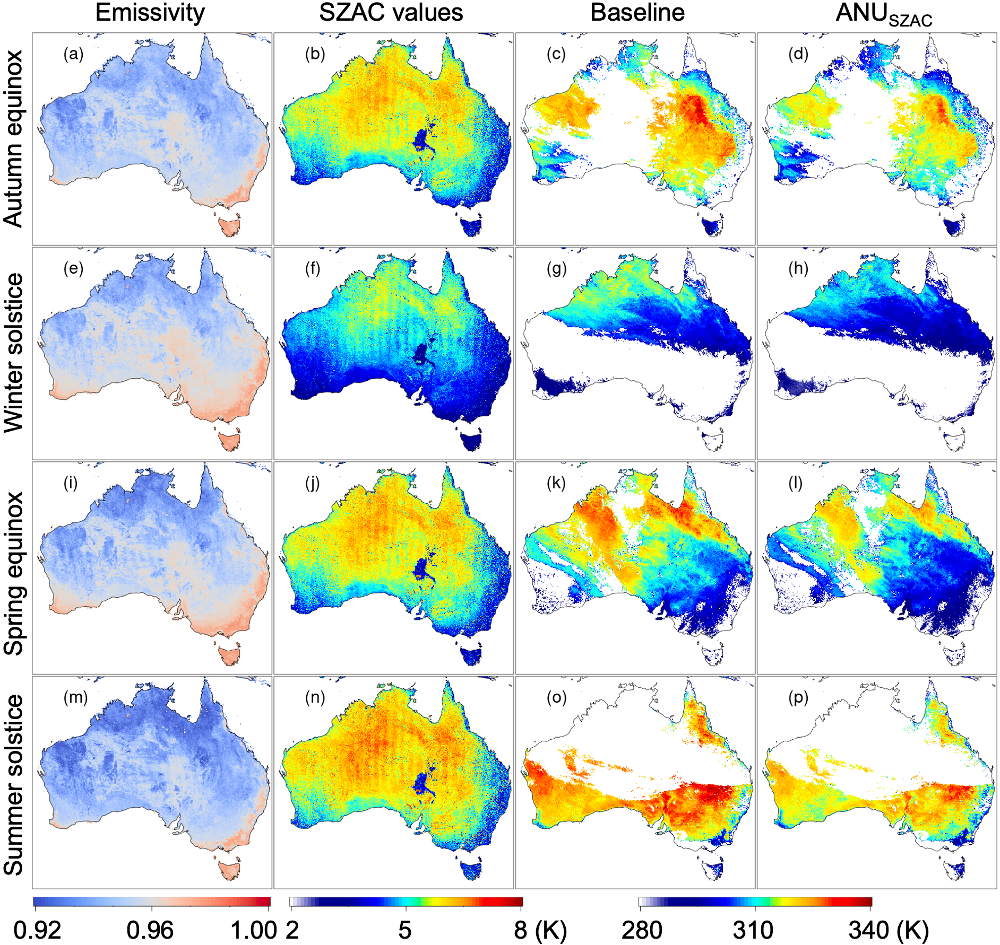
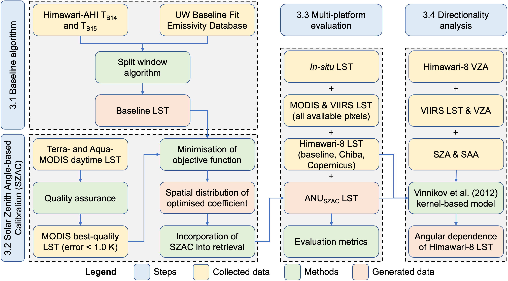

# Himawari-ANU

[](https://opensource.org/licenses/MIT)
[](https://www.r-project.org/)
[](https://twitter.com/yy_nash13)

## Contents

- [Overview](#overview)
- [Background](#background)
- [Usage](#usage)
- [Experimental scripts](#experimental-scripts)
- [Permalink](#permalink)
- [How to cite](#how-to-cite)
- [AGU23 poster](#agu23-poster)
- [References](#references)

## Overview

This is the repository for the development and operation of the Himawari-ANU LST collection.


## Background

## Usage

**Please make sure you are under the directory** `1_operational_scripts`, then simply run the following via the command line:

```
Rscript AHI_LSTv1.4.1_Operational_H9.R '2016-01-01'
```

This will generate two LST examples at 2016-01-01 00:00 and 00:10 UTC in `1_operational_scripts/output_examples`.

The input emissivity, values of the calibration term (i.e., SZAC values) and generated LST in different seasons are visualised as below. Note they are on different dates with the given test data here.



## Experimental scripts



## Permalink

The Himawari-ANU LST collection is publicly available from [DOI].

The published link of this repository is at [DOI].

## How to cite

If you found this repository helpful, please kindly consider citing:

Yu, Y., Renzullo, L. J., McVicar, T. R., Van Niel, T. G., Cai, D., Tian, S. and Ma, Y., 2024. Solar zenith angle-based calibration of Himawari-8 land surface temperature for correcting diurnal retrieval error characteristics, *Remote Sensing of Environment, Under Review*. Preprint DOI: https://doi.org/10.22541/essoar.170110655.56133673/v1

## AGU23 poster
Yu, Y., Renzullo, L. J., McVicar, T. R., Van Niel, T. G., Cai, D., and Tian, S., 2023. Himawari-ANU: A recalibrated geostationary land surface temperature dataset based on MODIS spatiotemporal characteristics, *AGU Fall Meeting 2023, San Francisco, United States, 11-15 December.*

## References

TBC