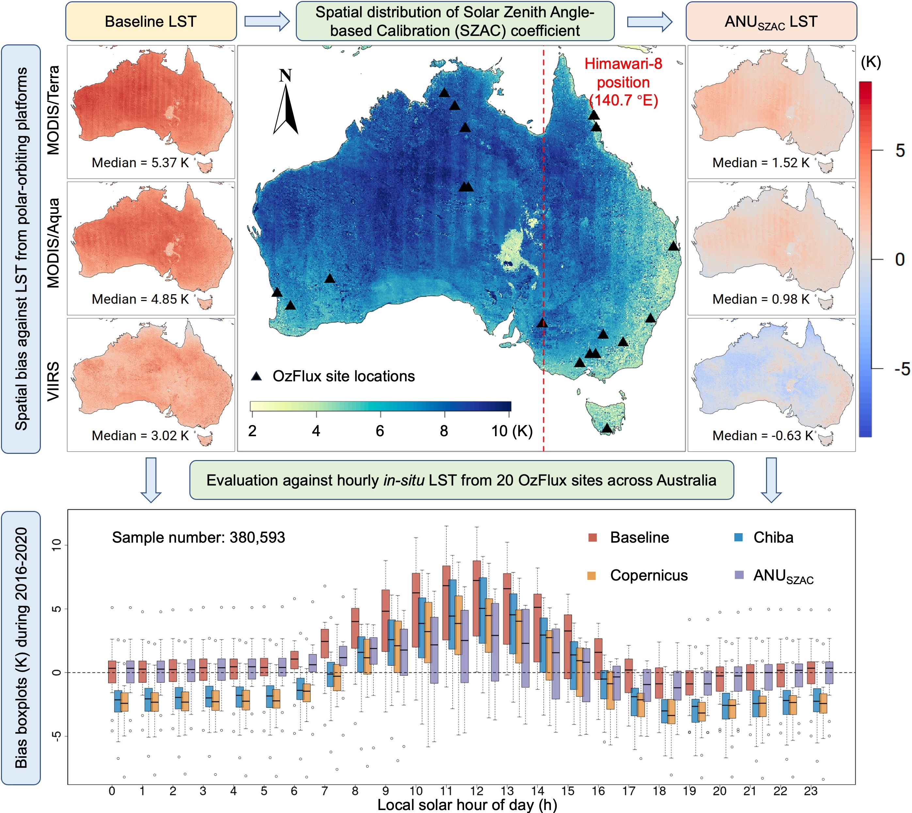
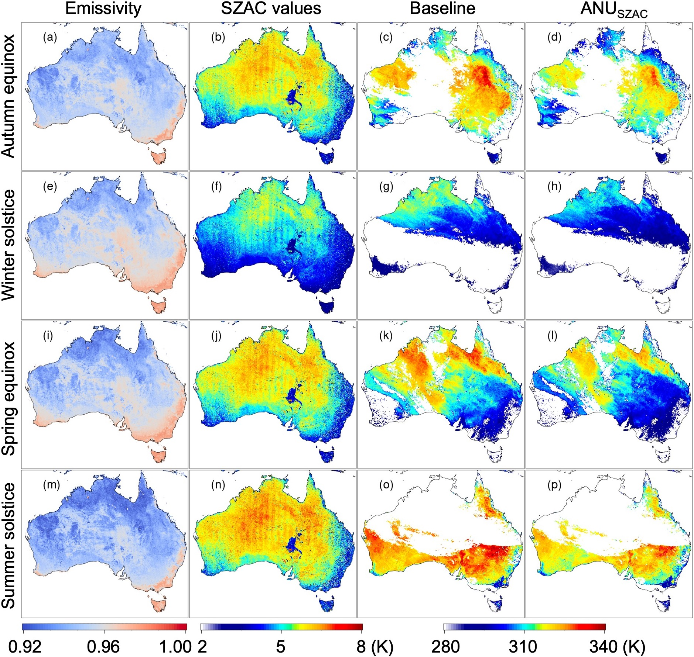
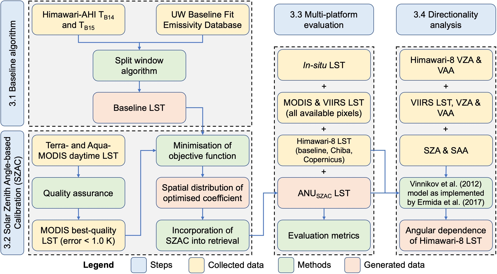

# Himawari-ANU

[](https://opensource.org/licenses/MIT)
[](https://www.r-project.org/)
[](http://doi.org/10.5281/zenodo.10929485)
[](https://twitter.com/yy_nash13)

## Contents

- [Overview](#overview)
- [Background](#background)
- [Operational script](#operational-script)
- [Experimental scripts](#experimental-scripts)
- [Figure scripts](#figure-scripts)
- [Permalink](#permalink)
- [How to cite](#how-to-cite)
- [AGU23 poster](#agu23-poster)
- [References](#references)

## Overview

This is the repository for the development and operation of the Himawari-ANU LST collection. The [operational script](#operational-script) provided herein is runnable with some minor test data, while the [processing scripts for the experiments](#experimental-scripts) are for reference purposes only.

## Background

The geostationary Himawari-8 satellite offers a unique opportunity to monitor sub-daily thermal dynamics over Asia and Oceania, and several operational land surface temperature (LST) retrieval algorithms have been developed for this purpose. However, studies have reported inconsistency between LST data obtained from geostationary and polar-orbiting platforms, particularly for daytime LST, which can arise from variations in viewing geometries and inherent differences in sensor types and LST algorithms. 

Despite this, previous research has primarily focused on analysing the directionality of LST without thoroughly exploring systematic differences between platforms. Hence, we presented a Solar Zenith Angle-based Calibration (SZAC) method to harmonise the daytime component of a split-window retrieved Himawari-8 LST (referred to here as the baseline) with the MODerate-resolution Imaging Spectroradiometer (MODIS) LST. SZAC describes the spatial heterogeneity and magnitude of diurnal LST discrepancies from different platforms, which is anticipated to complement typical directionality analyses.

We evaluated the proposed method against both remotely sensed and in-situ LST, with the graphical abstract showing the main findings in this research.

<p>


<em>Graphical abstract</em>
<p>

## Operational script

**Please make sure you are under the directory** `1_operational_scripts`, then simply run the following with a data variable formatted as `YYYY-MM-DD` (e.g., `2016-01-01` herein) via the command line:

```
Rscript AHI_LSTv1.4.1_Operational_H9.R '2016-01-01'
```

Himawari-ANU LST is produced at every 10 mins. This will generate two LST examples at 2016-01-01 00:00 and 00:10 UTC in `1_operational_scripts/output_examples`.

The input emissivity, values of the calibration term (i.e., SZAC values) and generated LST in different seasons are visualised as below. Note they are on different dates with the given test data here.

<p>


<em>Examples of input emissivity, SZAC values, baseline and ANU<sub>SZAC</sub> LST at 02:00 UTC in different austral seasons</em>
<p>

## Experimental scripts

The experimental scripts provided herein generally describe the process from 3.2 to 3.4 (as shown below), including the Solar Zenith Angle-based Calibration (SZAC), multi-platform evaluations, and a directionality analysis (Vinnikov et al., 2012; Ermida et al., 2017).

<p>


<em>Experimental design</em>
<p>

## Figure scripts

This directory provides the scripts to reproduce figures in the article. With the absence of input data, they are also not runnable and for reference purposes only though.

## Permalink

The Himawari-ANU LST collection is publicly available from the TERN Data Discovery Portal (https://doi.org/10.25901/1hww-x877).

This repository has a permalink registered at [Zenodo](https://zenodo.org/doi/10.5281/zenodo.10929485).

## How to cite

If you found this repository helpful, please kindly consider citing:

```
@article{YU2024114176,
author = {Yi Yu and Luigi J. Renzullo and Tim R. McVicar and Thomas G. {Van Niel} and Dejun Cai and Siyuan Tian and Yichuan Ma},
title = {Solar zenith angle-based calibration of Himawari-8 land surface temperature for correcting diurnal retrieval error characteristics},
journal = {Remote Sensing of Environment},
volume = {308},
pages = {114176},
year = {2024},
doi = {https://doi.org/10.1016/j.rse.2024.114176}
url = {https://www.sciencedirect.com/science/article/pii/S0034425724001949}
}
```

## AGU23 poster
Yu, Y., Renzullo, L. J., McVicar, T. R., Van Niel, T. G., Cai, D., and Tian, S., 2023. Himawari-ANU: A recalibrated geostationary land surface temperature dataset based on MODIS spatiotemporal characteristics, *AGU Fall Meeting 2023, San Francisco, United States, 11-15 December.* https://doi.org/10.22541/essoar.171269611.14193436/v1

## References

Ermida, S. L., DaCamara, C. C., Trigo, I. F., Pires, A. C., Ghent, D. and Remedios, J., 2017. Modelling directional effects on remotely sensed land surface temperature. *Remote Sens. Environ., 190*, 56-69. https://doi.org/10.1016/j.rse.2016.12.008

Vinnikov, K. Y., Yu, Y., Goldberg, M. D., Tarpley, D., Romanov, P., Laszlo, I. and Chen, M., 2012. Angular anisotropy of satellite observations of land surface temperature. *Geophys. Res. Lett., 39*. https://doi.org/10.1029/2012GL054059